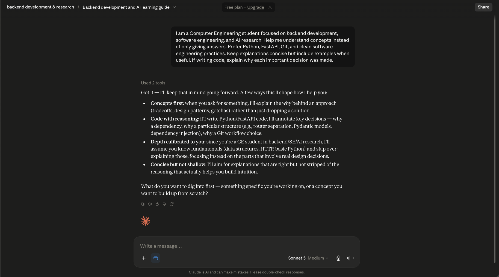
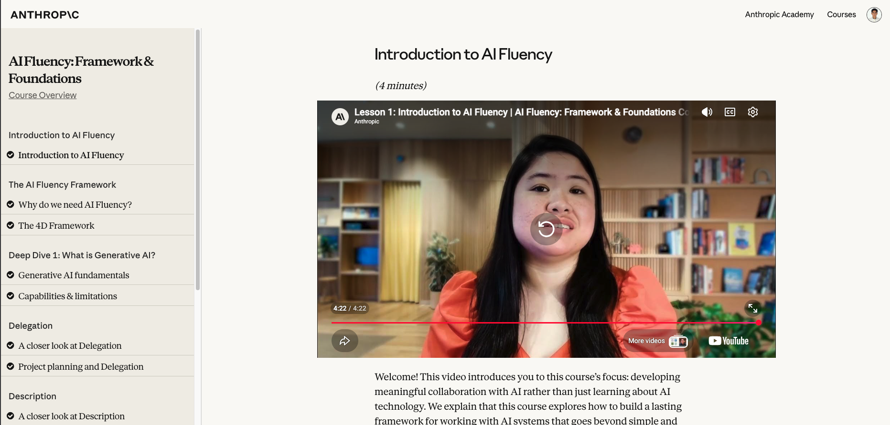

# FL-01: AI Workflow Audit and Tool Setup

**Assignment Code:** FL-01  
**Track:** General AI Fluency  
**Phase:** Setup

---

# Objective

This workflow audit documents my recurring weekly activities and identifies where artificial intelligence can improve my productivity while maintaining accountability for the final outcome. The goal is to determine which tasks should remain entirely my responsibility, which benefit from collaboration with AI, and which can be delegated or automated with appropriate review.

---

# Weekly Workflow Audit

| # | Recurring Task | Classification | Rationale |
|---|----------------|----------------|-----------|
| 1 | Serving customers and preparing beverages during my part-time coffee shop shift | **Just Me** | This requires physical work, customer interaction, and real-time decision-making that AI cannot perform. |
| 2 | Managing coffee shop opening, cleaning, and inventory tasks | **Just Me** | These are operational responsibilities that require my physical presence and accountability. |
| 3 | Completing DataCamp coding exercises and quizzes | **Collaborate with AI** | AI helps explain concepts and provides guidance, but I complete the exercises independently to reinforce learning. |
| 4 | Studying software engineering concepts (backend development, APIs, Git, and system design) | **Collaborate with AI** | AI simplifies complex topics and answers questions while I verify my understanding through practice. |
| 5 | Building backend applications for learning and assignments | **Delegate to AI with Review** | AI assists with generating implementation ideas and boilerplate code, but I review, modify, test, and understand the final solution. |
| 6 | Debugging programming assignments and projects | **Collaborate with AI** | AI suggests possible causes and solutions, while I identify the root cause and validate the fix. |
| 7 | Writing GitHub README files and technical documentation | **Delegate to AI with Review** | AI produces a structured first draft, while I ensure technical accuracy and completeness. |
| 8 | Writing Git commit messages | **Fully Automate** | AI can consistently generate concise and descriptive commit messages with minimal risk. |
| 9 | Conducting literature reviews and collecting references for my case study | **Collaborate with AI** | AI helps summarize research materials, but I evaluate source credibility and relevance myself. |
| 10 | Writing and revising my case study | **Delegate to AI with Review** | AI assists with drafting and improving writing quality, while I ensure originality, correctness, and academic integrity. |
| 11 | Completing FlyRank internship assignments | **Collaborate with AI** | AI serves as a learning assistant by explaining concepts and reviewing my work, while I remain responsible for understanding and completing every assignment. |
| 12 | Reviewing all work before submission | **Just Me** | I am accountable for the quality, correctness, and integrity of everything I submit. |

---

# Three Target Tasks (FL-02 to FL-04)

## 1. Completing FlyRank Backend Assignments

**Classification:** Delegate to AI with Review

### Definition of Done

- Assignment requirements are fully satisfied.
- Backend functionality works as expected.
- Code is tested before submission.
- I understand every major implementation decision.

---

## 2. Debugging Programming Projects

**Classification:** Collaborate with AI

### Definition of Done

- The root cause is correctly identified.
- The issue is resolved without introducing new bugs.
- I understand why the problem occurred.
- The solution is verified through testing.

---

## 3. Writing Technical Documentation

**Classification:** Delegate to AI with Review

### Definition of Done

- Documentation accurately describes the project.
- Setup instructions are clear and complete.
- Examples and commands are correct.
- Grammar and formatting are professional.

---

# AI Toolkit Setup

The following tools were configured as part of this assignment.

| Tool | Status |
|------|--------|
| ChatGPT | ✅ Completed |
| Claude | ✅ Completed |
| Anthropic Academy Account | ✅ Completed |
| AI Fluency: Framework & Foundations (First Module) | ✅ Completed |

---

# Claude Project

## Project Name

**Backend Development & AI Research**

## Custom Instructions

> I am a Computer Engineering student focused on backend development, software engineering, and AI research. Help me understand concepts instead of only giving answers. Prefer Python, FastAPI, Git, and clean software engineering practices. Keep explanations concise but include examples when useful. If writing code, explain why each important decision was made.

## Evidence

### Claude Project

---

# Anthropic Academy Evidence

### AI Fluency: Framework & Foundations

---

# Reflection

My weekly routine consists of working part-time at a coffee shop, studying through DataCamp, learning software engineering concepts, conducting a case study, and completing FlyRank internship assignments. This workflow audit helped me identify where AI is most valuable, particularly for learning, debugging, documentation, and brainstorming. At the same time, I recognized that responsibilities involving personal accountability, customer interaction, and final submission decisions should remain entirely my own.

---

## Submission Checklist

- ✅ Workflow audit containing 10+ recurring tasks
- ✅ Every task classified with a one-line rationale
- ✅ Three "Just Me" tasks with justification
- ✅ Three target tasks with measurable success definitions
- ✅ Claude Project configured with custom instructions
- ✅ Anthropic Academy enrollment and first module completed
- ✅ Supporting screenshots included

---

**End of FL-01 Submission**