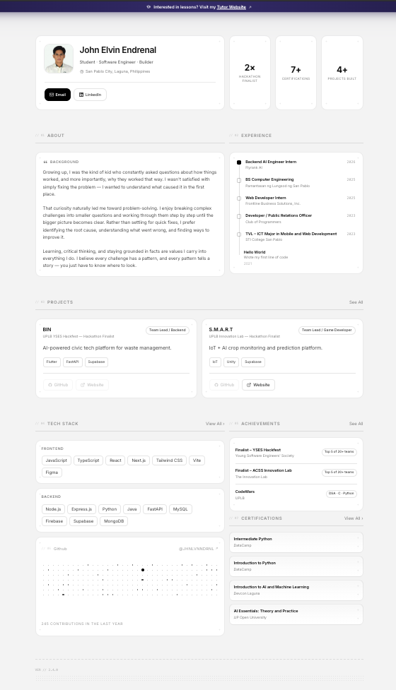
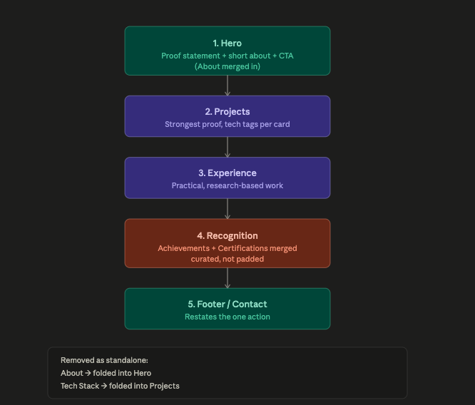
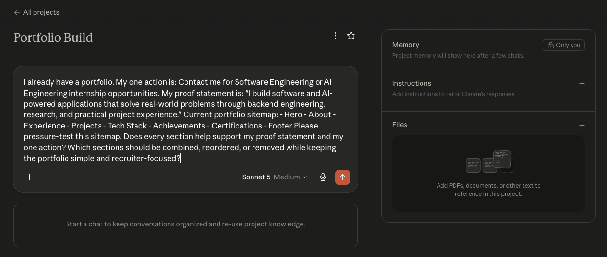
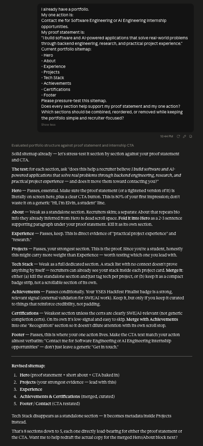

# FL-02: Draw the Path – Portfolio Sitemap + Toolkit

## Course Information

- **Assignment Code:** FL-02
- **Track:** General AI Fluency
- **Phase:** Setup

---

# Objective

This assignment reviews the structure of my existing portfolio to make sure every page earns its place against a single proof statement and a single action. I sketched a small sitemap, set up my free AI toolkit, configured an AI workspace to act as my build tutor going forward, and ran one real prompt to pressure-test the sitemap.

---

# One Action

**Contact me for Software Engineering or AI Engineering internship opportunities.**

---

# Proof Statement

I build software and AI-powered applications that solve real-world problems through backend engineering, research, and practical project experience. Through internships, hackathons, and personal projects, I continuously develop practical solutions while strengthening my technical foundation in software engineering and AI.

### Why

I want recruiters and collaborators to quickly recognize my ability to build meaningful software solutions and confidently reach out for internship opportunities.

---

# Existing Portfolio

I already had a portfolio before completing this assignment. Rather than starting from scratch, I reviewed the structure of my existing single-page site against my one person, my claim, and my one action.



---

# Portfolio Sitemap

The sitemap below sketches the few pages/sections it takes to walk one visitor from **landing**, to **believing me**, to **taking the one action** — resisting pages added just because other portfolios have them.

```text
Portfolio

├── Hero            → landing (states the claim + action)
├── Projects        → believing (proof of ability)
├── Experience      → believing (proof of track record)
├── About           → believing (who I am, brief)
└── Contact         → the one action
```

A photo of the hand-drawn sitemap sketch is included below.



---

# Toolkit Setup

I set up free accounts across the main AI chat tools so I can compare answers throughout the build:

- **Claude** — chosen as my main build partner
- **ChatGPT** — free tier account created
- **Gemini** — free tier account created

---

# AI Workspace

**Build partner:** Claude
**Workspace type:** Claude Project
**Workspace Name:** Portfolio Build

I configured a Claude Project with custom instructions covering:

- **Who I am** — a software/AI engineering student building a portfolio to land an internship
- **My proof statement**, pasted in full
- **A request to act as a tutor** — explaining its reasoning, challenging assumptions, flagging weak points, and recommending improvements that support my proof statement and one action

This Project will follow me for the rest of the build, so every future prompt starts from the same context instead of generic defaults.

Workspace configuration:



---

# Sitemap Pressure Test

I ran one real prompt inside the Project to pressure-test the sitemap against my claim and one action.

### Prompt

> Pressure-test my current portfolio sitemap against my proof statement and one action. Identify which sections are essential, which can be combined or removed, and recommend improvements while keeping the portfolio simple and recruiter-focused.

### Key Feedback

- Keep the Hero, Projects, Experience, and Contact sections — these directly serve the claim and the action.
- Move Projects closer to the top since they provide the strongest evidence of my abilities.
- Merge Achievements and Certifications into a single section rather than keeping them separate.
- Fold the Tech Stack into project cards instead of maintaining it as its own section.
- Shorten or fold the About section into the Hero to avoid an extra "just because" page.

Full prompt and output:



---

# What I'll Change

The one thing I'm committing to changing first: **moving Projects immediately after the Hero**, since that's the section doing the most work to prove my claim before asking for the one action.

---

# Files

```text
README.md
images/
├── current-portfolio.png
├── sitemap-sketch.png
├── claude-project.png
└── claude-pressure-test.png
```

---

# Reflection

This activity helped me evaluate my portfolio from a recruiter's perspective rather than a visual-design one. Sketching the sitemap around "landing → believing → action" made it obvious which sections were earning their place and which were there out of habit. Setting up the Claude Project as a standing build tutor, rather than starting fresh each chat, means the pressure-testing from here on will be grounded in the same proof statement and action every time.

**End of FL-02 Submission**