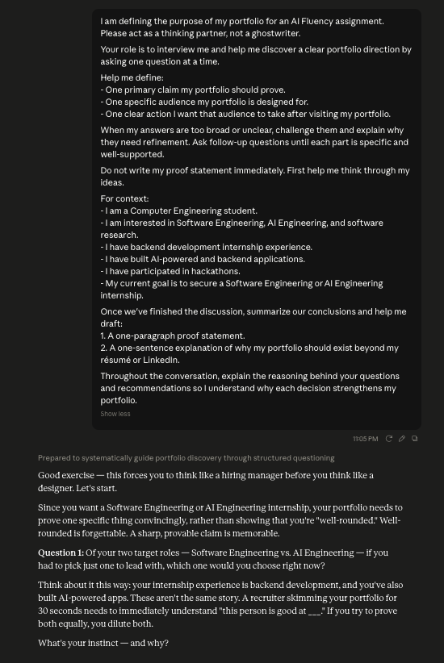
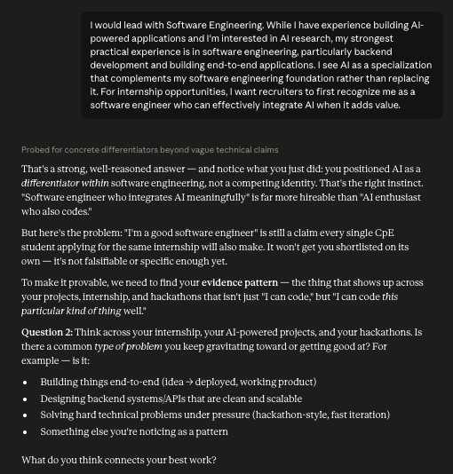
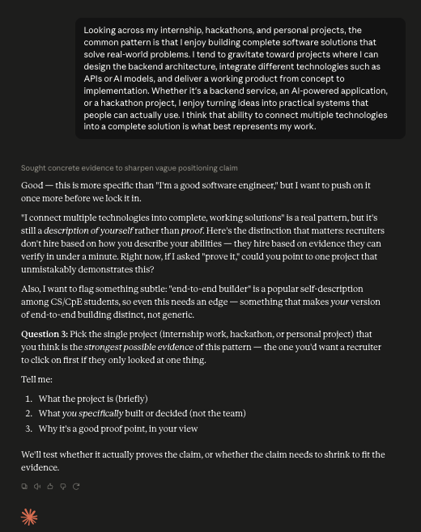

# FL-03: What Are You Proving?

## Course Information

- **Assignment Code:** FL-03
- **Track:** General AI Fluency
- **Phase:** Setup

---

# Objective

This assignment defines the core purpose of my portfolio by identifying a single claim, a specific audience, and one clear action. Rather than trying to appeal to everyone, the goal is to create a focused portfolio that demonstrates evidence of my abilities and encourages the right person to take action.

---

# One Claim

**I build software that solves real-world problems through backend engineering and AI.**

---

# One Person

**Software Engineering and AI Engineering internship recruiters and hiring managers evaluating internship candidates.**

---

# One Action

**Contact me for Software Engineering or AI Engineering internship opportunities.**

---

# Proof Statement

My portfolio demonstrates that I build software that solves real-world problems through backend engineering and AI. It is designed for software engineering and AI engineering internship recruiters who want evidence of practical skills beyond a résumé. Through my internship experience, hackathon projects, and personal software projects, I showcase how I approach engineering challenges, design practical solutions, and continuously improve as a developer. My goal is to provide recruiters with confidence in my ability to contribute to engineering teams and encourage them to contact me for internship opportunities.

---

# Why This Portfolio Exists

A résumé and LinkedIn profile summarize my experience, but they cannot fully demonstrate how I solve problems, design systems, and apply my technical skills through real projects.

---

# AI Thinking Partner

I used AI as a thinking partner to refine my proof statement rather than having it write the final version directly. Instead of giving me the answer, it interviewed me one question at a time, challenged vague or broad claims, and pushed me to back each answer with specific evidence. Below are the three key rounds of that conversation.

### Question 1 — Choosing One Role to Lead With

The AI asked me to pick one role to lead with instead of trying to present both Software Engineering and AI Engineering equally, since diluting the claim makes it forgettable.



### Question 2 — Finding a Common Pattern in My Work

Once I chose Software Engineering with AI as a differentiator, the AI pushed back that "I'm a good software engineer" still isn't provable on its own, and asked me to find the specific type of problem I keep gravitating toward across my internship, hackathons, and projects.



### Question 3 — Narrowing Down to the Strongest Proof

After I described my pattern as building complete, end-to-end solutions, the AI flagged that this was still a description of myself rather than proof, and asked me to pick the single strongest project a recruiter could look at to verify the claim.



---

# Reflection

This assignment helped me define the purpose of my portfolio before making design decisions. By narrowing my claim, audience, and desired action, I now have a clearer direction for presenting my projects and experience in a way that aligns with my career goal of securing a Software Engineering or AI Engineering internship.

---

# Files

```text
README.md
images/
├── ai-thinking-partner-1.png
├── ai-thinking-partner-2.png
└── ai-thinking-partner-3.png
```

**End of FL-03 Submission**