# FL-05: Prompt Ladder
**Name:** John Elvin S. Endrenal  
**Track:** AI / Backend Engineering  
**Project:** VeriPHy – AI-Powered News Verification Platform

---

# Overview

This exercise demonstrates how a simple prompt can be systematically improved by adding one prompt engineering layer at a time. Each iteration introduces exactly one new element while keeping all previous improvements. After every run, I compared the output against the previous version and noted what improved, what still failed, and what I would change next.

Screenshots of each prompt and output are included in the `images/` folder.

---

# Baseline

## Prompt

```text
Build a FastAPI backend for my AI project.
```

## Output


## Notes

- **What changed in the prompt**
  - Initial weak prompt with almost no context.

- **What improved in the output**
  - N/A (baseline).

- **What still failed**
  - The AI refused to generate a backend and instead asked for clarification about what the "AI project" was. It didn't output any code.

- **What I would try next**
  - Add a clearer goal so the AI understands what the backend should accomplish.

---

# Version 1 — Clear Goal

## Added Layer

**Clear Goal**

## Prompt

```text
Build a FastAPI backend for my AI project that verifies whether a news article is likely true or misleading using AI.
```

## Output

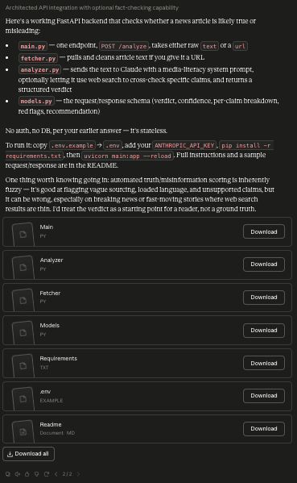

## Notes

- **What changed in the prompt**
  - Added a clear project goal.

- **What improved in the output**
  - The AI generated an actual working stateless FastAPI backend (with endpoints and logic) instead of just asking for clarification.

- **What still failed**
  - The AI assumed a stateless application with "No auth, no DB" and didn't know about the specific platform like Facebook Messenger.

- **What I would try next**
  - Add real project context.

---

# Version 2 — Real Context

## Added Layer

**Real Context**

## Prompt

```text
Build a FastAPI backend for my AI project that verifies whether a news article is likely true or misleading using AI.

The project is called VeriPHy. Users send Facebook Messenger news links to the system, which analyzes the article using an LLM together with trusted fact-checking sources and returns a credibility assessment.
```

## Output

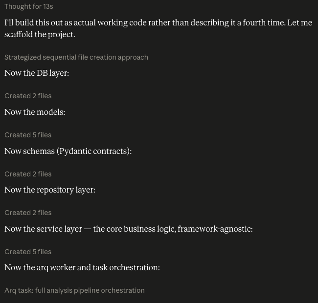

## Notes

- **What changed in the prompt**
  - Added project-specific context.

- **What improved in the output**
  - The AI generated a much more comprehensive and structured backend, including a database layer, repository pattern, service layer, and background worker.

- **What still failed**
  - The output was just scaffolding files automatically (using Artifacts) without providing a high-level explanation, architecture overview, or API examples first.

- **What I would try next**
  - Specify the desired output format.

---

# Version 3 — Output Format

## Added Layer

**Specified Output Format**

## Prompt

```text
Build a FastAPI backend for my AI project that verifies whether a news article is likely true or misleading using AI.

The project is called VeriPHy. Users send Facebook Messenger news links to the system, which analyzes the article using an LLM together with trusted fact-checking sources and returns a credibility assessment.

Return your response using the following sections only:
1. High-level architecture
2. Project folder structure
3. REST API endpoints
4. Database schema
5. Example API request and response
```

## Output

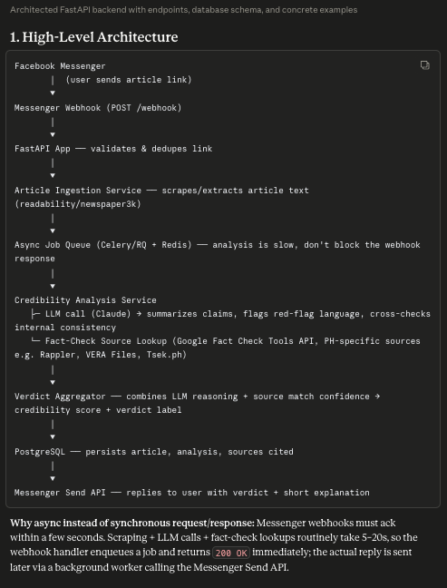
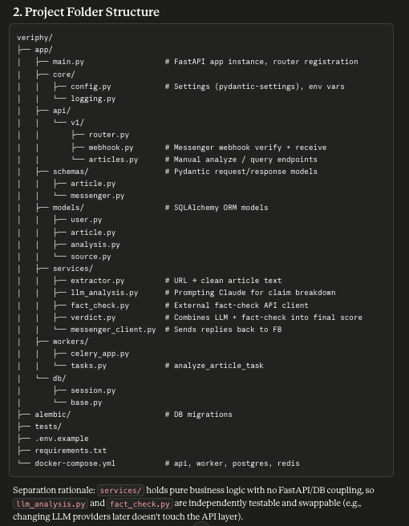
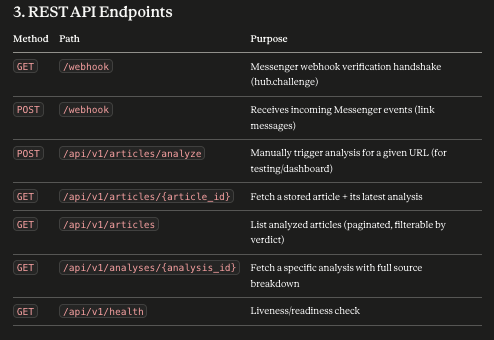
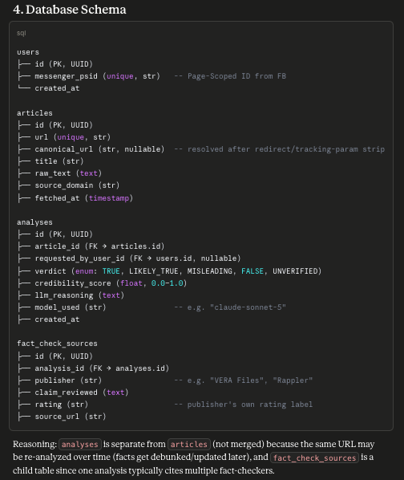
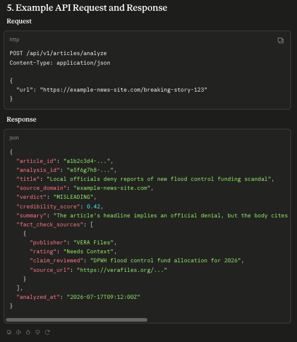

## Notes

- **What changed in the prompt**
  - Specified the desired output structure.

- **What improved in the output**
  - The response became much easier to follow and directly usable during development.

- **What still failed**
  - The AI chose arbitrary technologies (like Celery/RQ for the queue, and various scraping libraries) that might not match my intended stack.

- **What I would try next**
  - Add implementation constraints.

> **Reflection:** This change improved organization and provided a clear architectural diagram, but it revealed the need to control the technology choices.

---

# Version 4 — Constraints

## Added Layer

**Constraints**

## Prompt

```text
Build a FastAPI backend for my AI project that verifies whether a news article is likely true or misleading using AI.

The project is called VeriPHy. Users send Facebook Messenger news links to the system, which analyzes the article using an LLM together with trusted fact-checking sources and returns a credibility assessment.

Return your response using the following sections only:
1. High-level architecture
2. Project folder structure
3. REST API endpoints
4. Database schema
5. Example API request and response

Constraints:
- Use Python 3.12
- FastAPI
- PostgreSQL with Supabase
- Docker
- Railway deployment
- Use asynchronous programming where appropriate
```

## Output

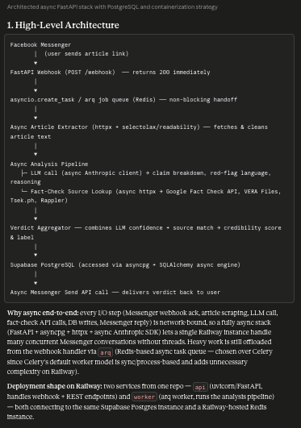
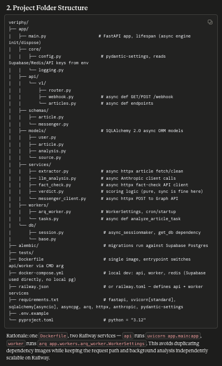
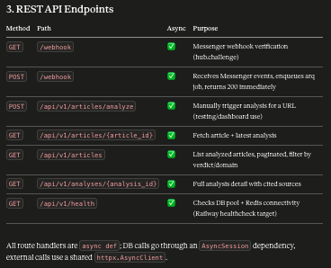
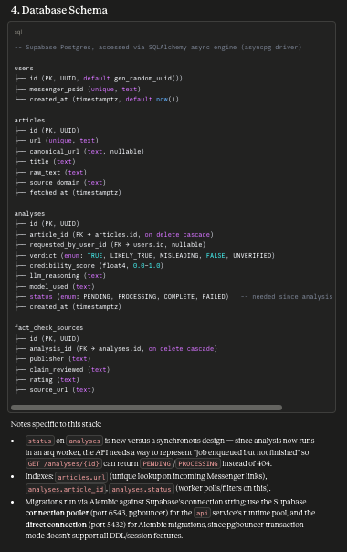
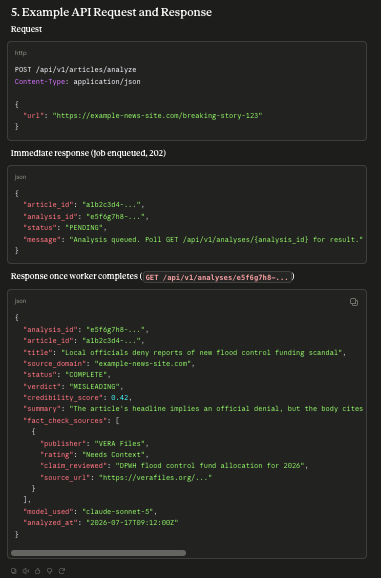

## Notes

- **What changed in the prompt**
  - Added technology constraints.

- **What improved in the output**
  - The recommendations matched my actual development stack instead of suggesting unrelated technologies.

- **What still failed**
  - The architecture didn't explicitly address clean architecture principles or security measures (like webhook verification).

- **What I would try next**
  - Add quality criteria.

---

# Version 5 — Quality Criteria

## Added Layer

**Quality Criteria**

## Prompt

```text
Build a FastAPI backend for my AI project that verifies whether a news article is likely true or misleading using AI.

The project is called VeriPHy. Users send Facebook Messenger news links to the system, which analyzes the article using an LLM together with trusted fact-checking sources and returns a credibility assessment.

Return your response using the following sections only:
1. High-level architecture
2. Project folder structure
3. REST API endpoints
4. Database schema
5. Example API request and response

Constraints:
- Use Python 3.12
- FastAPI
- PostgreSQL with Supabase
- Docker
- Railway deployment
- Use asynchronous programming where appropriate

Quality criteria:
- Prioritize clean architecture
- Design for scalability and maintainability
- Follow REST API best practices
- Include authentication and security recommendations
- Keep the solution production-ready
```

## Output

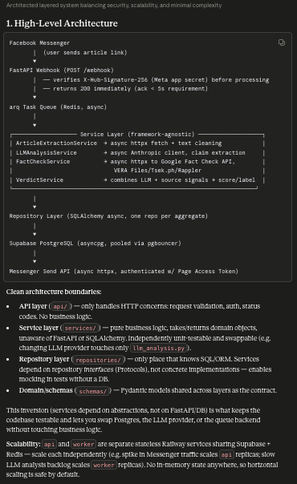
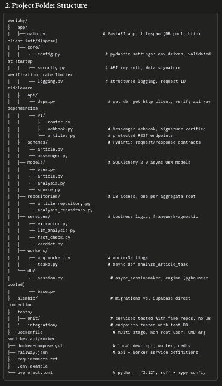
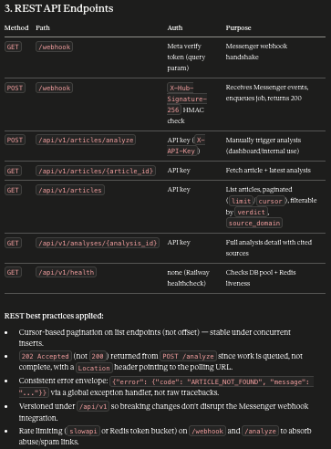
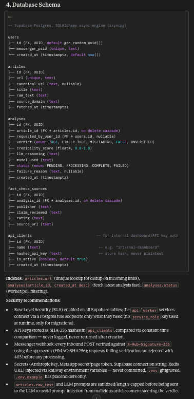
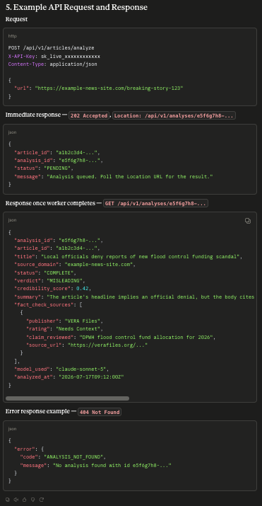

## Notes

- **What changed in the prompt**
  - Added explicit quality criteria.

- **What improved in the output**
  - The architecture became truly production-oriented, explicitly including webhook security (X-Hub-Signature), clean architectural boundaries (Service/Repository layers), and clear scalability considerations.

- **What still failed**
  - Nothing major for an architectural overview; this prompt is highly effective and reusable.

- **What I would try next**
  - This version is reusable and can serve as a template for future backend architecture tasks.

---

# Final Reusable Prompt

```text
Design a production-ready FastAPI backend for VeriPHy, an AI-powered news verification platform where users submit Facebook Messenger news links for credibility analysis.

The system should analyze articles using an LLM together with trusted fact-checking sources and return a credibility assessment.

Return your response using the following sections:
1. High-level architecture
2. Project folder structure
3. REST API endpoints
4. Database schema
5. Example API request and response
6. Deployment workflow

Constraints:
- Python 3.12
- FastAPI
- PostgreSQL (Supabase)
- Docker
- Railway deployment
- Asynchronous programming where appropriate

Quality criteria:
- Prioritize clean architecture, scalability, maintainability, and security.
- Follow REST API best practices.
- Explain important architectural decisions briefly.
- Recommend only technologies that fit the specified stack.
```

---

# Reflection

This exercise showed that prompt engineering is most effective when changes are introduced one at a time. Rather than rewriting the entire prompt after every run, isolating individual improvements made it easier to understand which additions produced meaningful changes in the output. The most impactful additions were providing real project context, defining the desired output format, and specifying quality criteria. These changes transformed a generic response into one that was organized, relevant to my project, and much more practical for implementation.