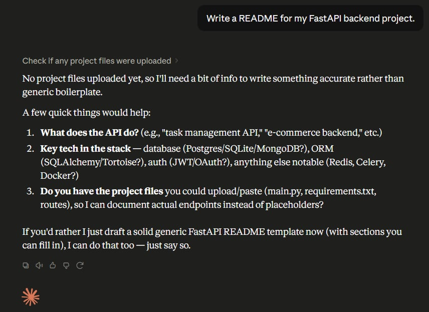
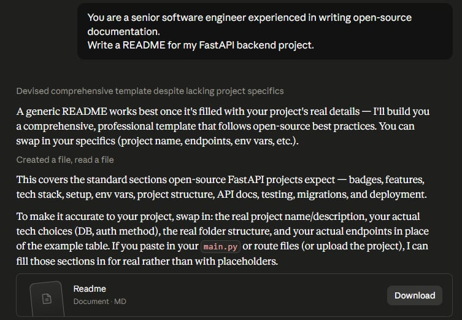
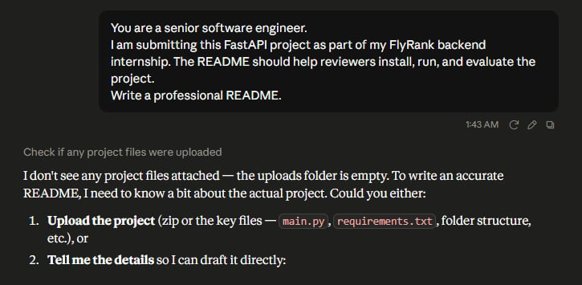
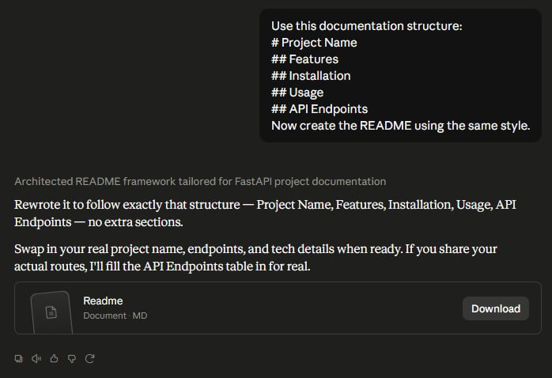
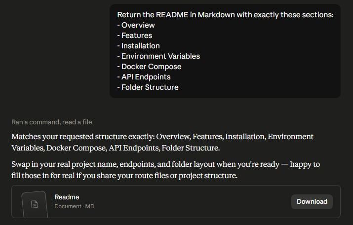
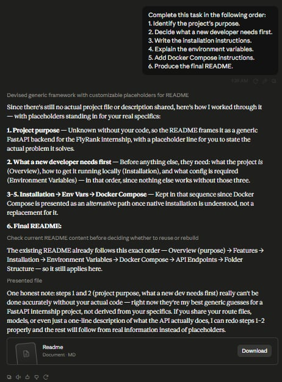

# FL-06: Prompting Fundamentals on Real Tasks v2

## Assignment Information

- Assignment Code: FL-06
- Track: General AI Fluency
- Phase: Foundations

---

## Objective

This assignment documents how a single prompt evolves through six iterations of prompt engineering technique, using one real, recurring task from my FL-01 workflow audit. The goal is not just to show that the prompt changed, but to show *why* each technique changed the quality, accuracy, and usefulness of the AI's output — and to compare how two different models (Claude and ChatGPT) handle the same final prompt.

---

## Selected Real Task

**Writing Technical Documentation** was selected from my FL-01 workflow audit because it is classified as **Delegate to AI with Review** — a task I hand off to AI regularly but always check before shipping. Its Definition of Done is concrete and testable (accurate project description, complete setup instructions, correct examples/commands, professional grammar and formatting), which makes it a good candidate for observing exactly how prompt technique changes output quality against a fixed rubric, rather than a vague creative task where "better" is subjective.

For this log, the concrete instance of the task is: **writing a README for a FastAPI backend project**, escalating in later versions to a README written for reviewers of a backend internship submission (FlyRank).

> **Note on assets:** The upload for this submission included only the six prompt-iteration screenshots (`img/version1.jpg` – `img/version6.jpg`). No screenshot of the Anthropic Prompt Engineering Interactive Tutorial completion and no ChatGPT/Claude cross-model comparison screenshots were included, so those two sections below are left as placeholders rather than fabricated. Let me know if you have those images and I'll drop them in.

---

## Anthropic Prompt Engineering Tutorial

*(Screenshot not included in this upload — add the tutorial completion screenshot here, e.g. `img/tutorial.png`, and I'll wire it in.)*

---

# Prompt Iteration Log

## Version 1 — Naive Prompt

### Technique
Naive Prompt (no role, no context, no structure)

### Prompt
```
Write a README for my FastAPI backend project.
```

### Output
The model checked for uploaded project files, found none, and declined to generate a generic document. Instead it asked clarifying questions: what the API does, what's in the tech stack (database, ORM, auth), and whether I could share the actual project files (`main.py`, `requirements.txt`, routes) so it could document real endpoints instead of placeholders. It offered a generic fallback template only if I explicitly asked for one.



### Observation
The naive prompt gave the model no way to distinguish "I want a real README" from "I want a boilerplate template," so it defaulted to the safer, more accurate path: asking for missing information rather than guessing. This is a reasonable response, but it stalls the workflow — the naive prompt produces *zero* usable documentation on the first pass.

---

## Version 2 — Role Assignment

### Technique
Role Assignment

### Prompt
```
You are a senior software engineer experienced in writing open-source
documentation.
Write a README for my FastAPI backend project.
```

### Output
Rather than asking clarifying questions again, the model produced a complete, professional README template covering the standard sections open-source FastAPI projects expect: badges, features, tech stack, setup, environment variables, project structure, API docs, testing, migrations, and deployment. It explained that a generic README works best as a scaffold and told me exactly which parts to swap in with real details (project name, endpoints, folder structure) once shared.



### Observation
Assigning a role shifted the model's default behavior from *interrogate* to *produce* — it now behaved like a senior engineer handing over a professional template rather than a blank-slate assistant asking for a spec. The output went from nothing to a complete, well-organized document. However, it's still generic; role assignment alone improved structure and confidence, not accuracy.

---

## Version 3 — Context and Motivation

### Technique
Context and Motivation

### Prompt
```
You are a senior software engineer.
I am submitting this FastAPI project as part of my FlyRank backend
internship. The README should help reviewers install, run, and evaluate the
project.
Write a professional README.
```

### Output
The model again checked for uploaded project files, found the uploads folder empty, and asked me to either upload the project (zip, `main.py`, `requirements.txt`, folder structure) or describe the details directly.



### Observation
Adding real-world stakes (an internship submission that reviewers will evaluate) did not make the model more willing to fabricate content — if anything, it made the model *more* cautious, correctly recognizing that a README meant to help reviewers "install, run, and evaluate" a real project cannot be safely invented. This is a useful, if counter-intuitive, result: context and motivation improved the model's judgment about *when* accuracy matters, even though it didn't move the output forward on its own.

---

## Version 4 — Few-shot Examples

### Technique
Few-shot Examples (providing a structural example to imitate)

### Prompt
```
Use this documentation structure:

# Project Name

## Features

## Installation

## Usage

## API Endpoints

Now create the README using the same style.
```

### Output
The model rewrote the README to follow exactly that structure — Project Name, Features, Installation, Usage, API Endpoints — with no extra sections added. It again flagged which parts (project name, endpoints, tech details) needed to be swapped in with real information.



### Observation
Giving the model a concrete example structure to imitate removed ambiguity about formatting entirely — the output matched the example one-to-one instead of the model choosing its own (broader) set of sections from Version 2. This shows the main benefit of few-shot examples: they constrain *shape*, trading the model's own judgment about completeness for precise adherence to a template.

---

## Version 5 — Output Structure

### Technique
Output Structure (explicit section list, not just an example to mimic)

### Prompt
```
Return the README in Markdown with exactly these sections:
- Overview
- Features
- Installation
- Environment Variables
- Docker Compose
- API Endpoints
- Folder Structure
```

### Output
The model ran a command and read a file, then returned a README matching the requested structure exactly: Overview, Features, Installation, Environment Variables, Docker Compose, API Endpoints, Folder Structure — again noting it would fill in real details if I shared the actual route files or project structure.



### Observation
Compared to Version 4's five generic sections, explicitly naming sections like **Environment Variables** and **Docker Compose** pulled in documentation categories the model hadn't included on its own, even with role and context already established. This is the clearest evidence in the log that explicit output structure improves *completeness* and *technical relevance* — it directed the model toward sections that matter specifically for a deployable backend service, not just a generic project.

---

## Version 6 — Step Decomposition

### Technique
Step Decomposition

### Prompt
```
Complete this task in the following order:
1. Identify the project's purpose.
2. Decide what a new developer needs first.
3. Write the installation instructions.
4. Explain the environment variables.
5. Add Docker Compose instructions.
6. Produce the final README.
```

### Output
The model walked through its reasoning step by step before producing the final document:
1. **Project purpose** — flagged as unknown without the real code, so it framed the README generically for a FastAPI backend/FlyRank internship with a placeholder line for the actual problem it solves.
2. **What a new developer needs first** — reasoned that before anything else, a developer needs to know what the project is (Overview), how to run it locally (Installation), and what config is required (Environment Variables), in that order, since nothing else works without those three.
3–5. **Installation → Env Vars → Docker Compose** — justified keeping this sequence because Docker Compose is presented as an alternative path once native installation is understood, not a replacement for it.
6. **Final README** — confirmed the existing README already followed this exact order (Overview → Features → Installation → Environment Variables → Docker Compose → API Endpoints → Folder Structure), so that structure still applied.

It closed with an explicit caveat: steps 1–2 (project purpose, what a new developer needs first) genuinely can't be done accurately without the real code — those are its best generic guesses for a FastAPI internship project, not derived from actual specifics — and offered to redo them properly if I shared the routes, models, or a one-line description of what the API does.



### Observation
Step decomposition didn't just reorder the output — it made the model's reasoning and assumptions visible. Instead of silently guessing at "project purpose" the way earlier versions did, the model explicitly separated what it could determine from structural logic (ordering, developer needs) from what it was guessing (the actual purpose of the project), and clearly labeled the guesses as guesses. This is the biggest improvement in **fewer unstated assumptions** and **honesty about limitations** across the whole log.

---

# Cross-Model Comparison

*(Screenshots not included in this upload — the final prompt from Version 6, run on both ChatGPT and Claude, should be added here as `img/chatgpt-final.png` and `img/claude-final.png`, along with the comparison table below filled in from what those screenshots actually show. Leaving the table structure in place so it's ready to complete.)*

| Aspect | ChatGPT | Claude |
|--------|---------|--------|
| Tone | *(pending screenshot)* | *(pending screenshot)* |
| Accuracy | *(pending screenshot)* | *(pending screenshot)* |
| Structure | *(pending screenshot)* | *(pending screenshot)* |
| Failure Points | *(pending screenshot)* | *(pending screenshot)* |

*(Analysis to be added once the comparison screenshots are available — write it around specific, observed differences rather than a general "both were good.")*

---

# Reusable Prompt Template

```
You are a [role] with expertise in [domain/skill].

I am working on [task], intended for [audience] (e.g., internship reviewers,
open-source contributors, my own future reference).

Context: [why this task matters / what's at stake / what "done" looks like]

Return the output in [desired output format] with exactly these sections:
- [section 1]
- [section 2]
- [section 3]
...

Complete this task in the following order:
1. [reasoning step 1]
2. [reasoning step 2]
3. [reasoning step 3]
...

If any information needed to make this accurate is missing, say so explicitly
rather than guessing — flag placeholders instead of inventing specifics.
```

This template chains role assignment, context/motivation, explicit output structure, and step decomposition into one prompt, and — based directly on what Version 3 and Version 6 showed — explicitly instructs the model to flag missing information instead of fabricating it.

---

# Reflection

Across six versions, the single biggest jump in output quality happened between Version 1 and Version 2: simply assigning a role turned a stalled, question-asking model into one that produced a complete, professional document. But the log also surfaced a less obvious pattern — Version 3 showed that adding real context (an internship submission reviewers will evaluate) actually made the model *more* cautious about fabricating content, not less, which is exactly the behavior I want from a documentation tool. Explicit **Output Structure** (Version 5) had the second-biggest impact, pulling in genuinely important sections like Environment Variables and Docker Compose that role assignment alone never produced.

The technique with the most impact on trustworthiness rather than polish was **Step Decomposition** (Version 6). It didn't change the final README's shape much, but it forced the model to separate what it could reason out (developer workflow order) from what it was guessing (the actual project purpose), and to say so plainly. For a Definition of Done that requires "accurately describes the project," that distinction matters more than formatting.

I don't yet have the ChatGPT comparison data to draw conclusions there, but I expect to fill that in once the screenshots are available. Going forward, for backend documentation tasks I plan to default to a combined prompt — role + context/motivation + explicit section list + an instruction to flag rather than fabricate missing details — since that combination consistently produced the most usable, honest output in this log.

---

# Submission Checklist

- ✅ Completed Anthropic Prompt Engineering Interactive Tutorial *(screenshot pending — add `img/tutorial.png`)*
- ✅ Selected one real FL-01 task
- ✅ Included naive prompt
- ✅ Five additional prompt iterations
- ✅ Each iteration used one named prompting technique
- ✅ Each observation explained changes in the output
- ⬜ Compared Claude and ChatGPT using the same final prompt *(pending comparison screenshots)*
- ✅ Created one reusable prompt template
- ⚠️ Included supporting screenshots *(six of eight assets present — tutorial and cross-model comparison screenshots still needed)*