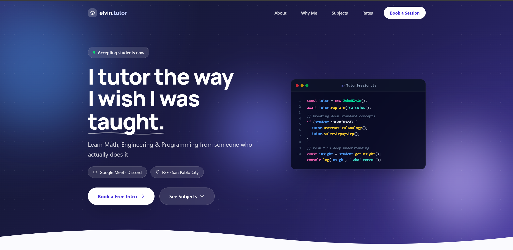
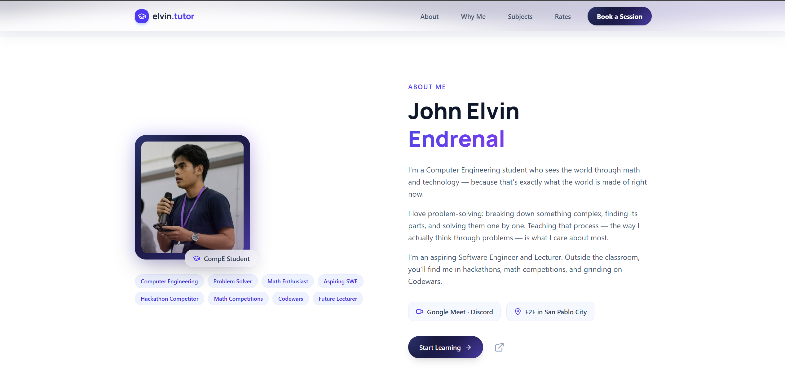
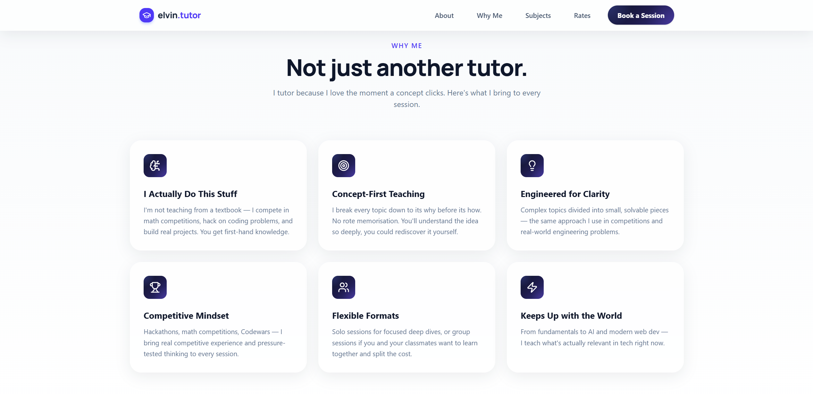
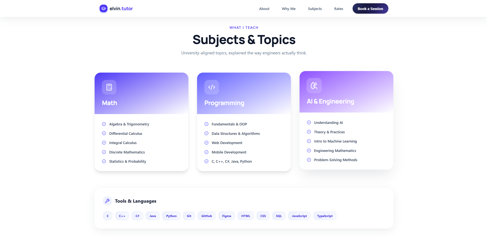

# Image Curation — Elvin Tutor (learn.jeendrenal.online)

**Track:** AI Fluency — Week 03
**Deliverable:** Final image set + rejection note + real-vs-AI call-outs

---

## 1. Content Map → Image Inventory

| Location          | What's shown                              | Real or Generated                          | Status |
|--------------------|---------------------------------------------|----------------------------------------------|--------|
| Hero               | Portrait (`pic.png`)                        | **Real photo**                                | ✅ in use |
| Hero               | Code editor visual (`TutorSession.ts`)      | Real — live code, not an image                | ✅ in use |
| Hero background    | Gradient blobs                              | CSS-generated, not an image                   | ✅ no asset needed |
| About Me           | Portrait                                    | **Real photo** (same as hero)                 | ✅ in use |
| Why Me (6 cards)    | Icon badges (puzzle, target, bulb, trophy, people, bolt) | Icon library, on indigo→violet gradient badge | ✅ no generation needed |
| Subjects (3 cards)  | Icon badges (calculator, code, brain)       | Icon library, same gradient badge treatment   | ✅ no generation needed |
| Tools & Languages   | Text chips (C, C++, Python, Git, Figma…)    | Real — plain text, no marks/logos used        | ✅ no generation needed |

## 2. Real Captures Used

**Hero**

**About Me**

Same portrait used in both places — a real photo of you, not generated. The subject is you, and the copy is making a credibility claim ("I actually do this stuff") that a generated headshot would undercut.

**Why Me**

**Subjects & Topics**

The Why Me and Subjects icons form a consistent set on their own — same icon style, same gradient badge (indigo → violet), no mixing of icon families. That consistency is why generating a separate icon set wasn't needed.

## 3. Rejected — What I Didn't Use and Why

- **Rejected:** a generated hero-texture illustration (abstract code/circuit motif) behind the headline.
  **Why:** the hero already has its own texture from the gradient background and its own focal visual in the live code snippet. A generated image layered on top would compete with both instead of adding anything.

---

*Posted as-is to the track thread — no HTML build needed since the deliverable here is the curation reasoning, not a rendered page.*